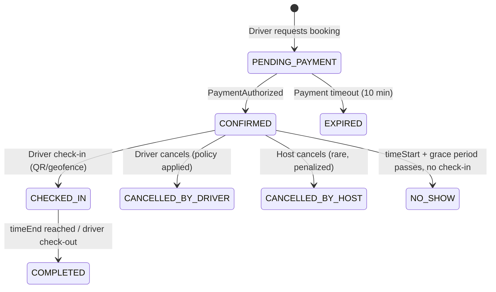
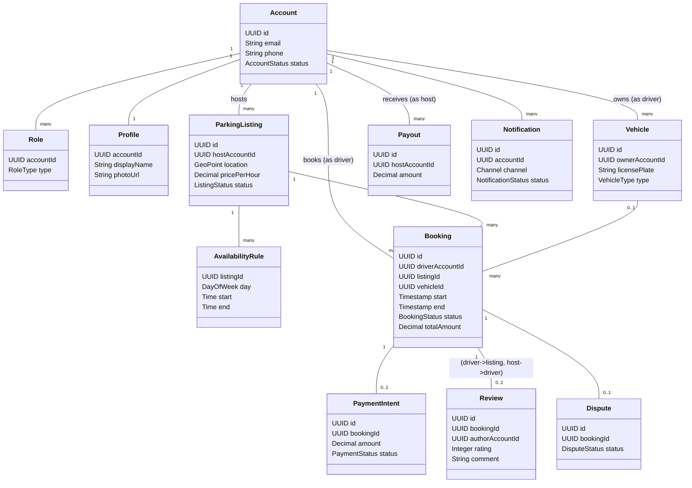
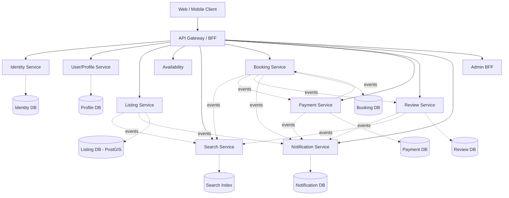
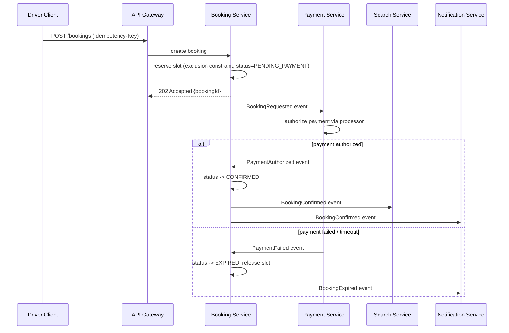

# ParkSmart — Product & Architecture Review
### From College Project to Parking Marketplace: A Redesign Blueprint for Spring Boot / Clean Architecture / DDD / Microservices

---

## 0. Executive Summary & A Critical Correction

Before anything else: **the repository does not match the product description in the brief**, and that gap is itself the most important finding of this review.

The brief describes ParkSmart as an Airbnb-style marketplace with Hosts, Drivers, vehicle management, reviews/ratings, notifications, maps, dashboards, and a Firebase-oriented data layer with React-style "pages" and "components." The actual repository (`NinadGawali/ParkSmart`, `main`, 5 commits) is:

- A **single-file-per-concern Flask monolith** (`app/__init__.py`, `models.py`, `routes.py`, `utils.py` — 660 lines total).
- Server-rendered **Jinja2 templates** styled with Tailwind CDN, not React.
- **MySQL via SQLAlchemy** (AWS RDS in production), not Firebase/Firestore.
- **3 database tables**: `users`, `parking_spaces`, `bookings`. No hosts, no vehicles, no reviews, no payments table, no notifications table, no admin anything.
- **One undifferentiated `User` role** — any user can both list a space and book a space. There is no Host/Driver distinction anywhere in code or schema.
- Email is the *only* notification channel, sent synchronously (best-effort) via Gmail SMTP for booking receipts.
- "Payment" is entirely fictional: the app computes `hours × price_per_hour` and stores it as `total_amount`. **No payment gateway, no charge, no ledger, no refund path exists.** Money changes hands nowhere in this code.
- There are **no reviews, ratings, vehicle records, availability calendars, cancellations, disputes, payouts, or admin capabilities** at all.
- `test.html` — checked into source control — contains a **live-looking AWS RDS hostname and an `admin` database username** in a raw `mysql` CLI command, which is a credential-hygiene red flag independent of whether the password was included.

None of this is a criticism of the original author — it is exactly what a scoped college project should look like: a working, honest proof of concept. But it means this review has two honest starting points to hold simultaneously:

1. **What exists today** is a two-sided marketplace *skeleton* — the schema (`owner_id` on `parking_spaces`, a separate `bookings` table with a time window and a computed price) already encodes the core Airbnb-for-parking idea better than the README's "parking management" framing suggests. That is the real, reusable seed of the product.
2. **Everything the brief calls a marketplace feature** (roles, vehicles, reviews, payments, notifications beyond email, geosearch, admin, disputes, payouts) needs to be **designed from zero**, because none of it exists in any form — not even as a stub or TODO.

The rest of this document treats the existing Flask app as the **source of business intent** (what a driver/owner needs to do) and designs the **target system** as a Spring Boot / DDD / microservices marketplace platform, per the brief's explicit request for a full redesign rather than a migration.

---

## 1. Repository Inventory (Ground Truth)

| File | Lines | Purpose |
|---|---|---|
| `app/__init__.py` | 36 | Flask app factory, config, session cookie flags, DB URI construction, blueprint registration |
| `app/models.py` | 44 | 3 SQLAlchemy models: `User`, `ParkingSpace`, `Booking` |
| `app/routes.py` | 401 (161 of which are dead, commented-out duplicate code left in the file) | All HTTP routes: `/`, `/register`, `/login`, `/logout`, `/dashboard`, `/post-parking`, `/api/search-parking`, `/book`, `/search` |
| `app/utils.py` | 132 | SMTP email sending + inline HTML email templating |
| `app/templates/*.html` | 7 files, ~485 lines | Jinja2 templates, Tailwind CDN, inline vanilla JS calling Google Maps JS API and the search/book endpoints |
| `schema.sql` | 33 | Canonical MySQL DDL for 3 tables |
| `seed_data.py`, `run_db_create.py` | 47 | Dev seeding / table creation scripts |
| `requirements.txt` | 4 | Flask 2.2.5, Flask-SQLAlchemy 3.0.3, PyMySQL 1.0.3, python-dotenv 1.0.0 |
| `test.html` | 76 | A duplicate of `post_parking.html` with a **raw `mysql` CLI connection string to an AWS RDS host with an `admin` user appended at the bottom** — dead file, should never have been committed |

**No CI/CD, no tests, no Dockerfile, no `.env.example`, no migrations tool (Alembic absent — `db.create_all()` is used instead), no logging config beyond Flask's default logger, no API versioning, no OpenAPI spec.**

---

## 2. Domain Reality Check: What the Code Actually Encodes

Reading `models.py` and `routes.py` together, the *implicit* domain model is:

- A `User` is both potential Host and potential Driver — same table, same login, no `role` column.
- A `ParkingSpace` belongs to exactly one `owner_id` (a `User`). It has a flat `is_available` boolean **and** a derived availability computed at query time from overlapping `Booking` rows (`api_search_parking`) — two separate and only loosely consistent sources of truth for "can I book this."
- A `Booking` has an **optional** time window: `time_start`/`time_end` can both be `NULL`, in which case the code and comments treat it as "an indefinite exclusive lock." This is a business rule invented ad hoc in a comment, never enforced by a constraint, and never exposed anywhere in the UI (no template creates a NULL-window booking) — it is effectively **dead, undocumented behavior with real side effects** (an indefinite booking would permanently blackout a space).
- Pricing is `price_per_hour`, and total is computed **server-side at booking time** — good instinct — but with no minimum charge policy, no cancellation-fee logic, no currency field (hardcoded ₹ in the email template only), and no commission/take-rate concept anywhere.

This matters because it tells us the original author was *already* reaching for marketplace semantics (owner vs. booker, price × duration, availability windows) without a role system to back it up. The redesign should honor that instinct while making the missing roles, states, and money-movement explicit.

---

## 3. Module-by-Module Review

For every module: **Current State → Problems → Missing Product Features → Recommended Architecture → Suggested DB → Suggested APIs → DTOs → Business Rules → Events → Microservice Ownership.**

### 3.1 Authentication & Registration

**Current State**
`register()`/`login()`/`logout()` in `routes.py`. Password hashed with Werkzeug's `generate_password_hash` (PBKDF2). Session-based auth: `session["user_id"]` set on login, Flask's signed cookie is the only credential, 4-hour permanent session lifetime. `SESSION_COOKIE_HTTPONLY=True`, `SAMESITE=Lax`, `SECURE` toggled by an env flag (defaults to **insecure**, i.e., cookies sent over plain HTTP unless `USE_HTTPS=1` is manually set).

**Problems**
- **No email verification** — `email` is optional and never confirmed, yet it's the sole channel for booking receipts (which will silently fail or go to the wrong inbox).
- **No password policy** (length/complexity), no rate limiting on login (brute-force is trivial), no account lockout.
- **No CSRF protection** on any POST form (`register`, `login`, `post-parking`) — Flask-WTF/CSRF token is absent.
- **No password reset flow at all.**
- Session-cookie auth doesn't scale horizontally without sticky sessions or a shared session store, and it doesn't map to a mobile app or third-party API consumer.
- `User.query.get(session["user_id"])` runs on nearly every request with no caching.
- **No roles.** Anyone can list a space and anyone can book — legally and operationally this conflates two very different KYC/liability profiles (a host renting out a driveway vs. a driver parking a car).
- The SECRET_KEY defaults to `"dev-secret"` if the env var is missing — a classic "will ship to prod by accident" trap.

**Missing Product Features**
Social login, phone verification (important for a physical-world marketplace — hosts want to know a real person is coming), 2FA, device/session management ("log out of all devices"), account deletion/GDPR export, host KYC (ID + address proof) before listing goes live, terms-of-service acceptance & audit trail.

**Recommended Architecture (Identity & Access Service)**
- **Entities**: `Account` (id, email, phone, passwordHash, status: PENDING_VERIFICATION/ACTIVE/SUSPENDED/DELETED, createdAt, updatedAt), `Role` (DRIVER, HOST, ADMIN — many-to-many with Account, since a user can be both host and driver), `RefreshToken`, `VerificationToken` (email/phone, purpose, expiry).
- **Auth model**: JWT access token (short-lived, 15 min) + rotating refresh token (httpOnly cookie or secure storage on mobile), signed with RS256 so other services can verify without calling Identity Service.
- **Services**: `RegistrationService`, `AuthenticationService`, `TokenService`, `PasswordResetService`.
- **Controllers/API**:
  - `POST /api/v1/auth/register` — `RegisterRequest{email, phone, password, acceptedTermsVersion}`
  - `POST /api/v1/auth/login` — `LoginRequest{email, password}` → `TokenResponse{accessToken, refreshToken, expiresIn}`
  - `POST /api/v1/auth/refresh`
  - `POST /api/v1/auth/logout`
  - `POST /api/v1/auth/verify-email`, `POST /api/v1/auth/verify-phone`
  - `POST /api/v1/auth/password/forgot`, `POST /api/v1/auth/password/reset`
  - `POST /api/v1/accounts/{id}/roles` (admin-only, or self-service "become a host")
- **Validation**: email format + uniqueness (case-insensitive collation), password ≥ 10 chars with complexity, phone via libphonenumber, rate-limit login attempts per IP + per account (e.g., 5/15min, exponential backoff, then CAPTCHA).
- **Events**: `AccountRegistered`, `AccountVerified`, `RoleGranted(HOST)`, `PasswordResetRequested`.
- **Ownership**: **Identity Service** (bounded context: authentication, authorization, roles — *not* profile data like name/photo, which belongs to User/Profile Service).
- **Security**: bcrypt/argon2id (not PBKDF2-via-Werkzeug default) for new hashes; store only hash; secrets in a vault (AWS Secrets Manager/Vault), never `.env` committed patterns; CSRF tokens on any cookie-based flow; strict CORS allow-list.

---

### 3.2 Profile

**Current State**: Does not exist as a concept. `User` has only `username`, `email`, `password_hash`. No name, phone, photo, address, or preferences.

**Problems**: A marketplace where a driver is about to enter someone's private driveway with zero identity signal (no photo, no verified name, no vehicle on file) is a trust and safety gap, not just a missing feature.

**Missing Product Features**: display name, profile photo, phone (verified), default vehicle, payout details (for hosts), notification preferences, saved/favorite listings, host bio & response rate, driver trust score.

**Recommended Architecture (User/Profile Service)**
- **Entities**: `Profile` (accountId FK, displayName, photoUrl, bio, city, defaultVehicleId, notificationPreferences JSON), `PayoutAccount` (hostId, bankToken/StripeConnectId, verified boolean) — payout details should be **tokenized via a payment processor**, never stored raw.
- **APIs**: `GET/PATCH /api/v1/profiles/me`, `GET /api/v1/profiles/{id}` (public subset only — never expose email/phone to other users directly; mediate contact through masked channels, as Airbnb does).
- **Business rules**: a host profile must be ≥ X% complete (photo + verified phone) before a listing can be published (`ListingActivationPolicy`).
- **Events**: `ProfileUpdated`, `HostEligibilityChanged`.
- **Ownership**: User/Profile Service, separate from Identity so that auth churn doesn't couple to profile churn.

---

### 3.3 Vehicle Management

**Current State**: Does not exist. There is no `vehicle` table, column, or field anywhere in the schema or forms.

**Problems**: A parking marketplace fundamentally needs to know *what* is being parked — vehicle dimensions determine which spaces are even viable (a compact driveway can't fit an SUV or a truck), and license plate is often required for host verification or gate/QR access.

**Missing Product Features**: add/edit/remove vehicles, primary vehicle, vehicle type (car/SUV/motorcycle/EV), license plate, EV charging requirement flag — this last one should actually filter search results.

**Recommended Architecture (owned by User/Profile Service, or a light Vehicle Service if scale demands)**
- **Entity**: `Vehicle` (id, ownerAccountId, licensePlate, type: SEDAN/SUV/TRUCK/MOTORCYCLE/EV, make, model, color, isPrimary, createdAt).
- **APIs**: `POST/GET/PATCH/DELETE /api/v1/vehicles`, scoped to the authenticated driver.
- **Validation**: plate format per locale, at most one `isPrimary=true` per account (DB partial unique index), vehicle type must be one a booking references so bookings can be filtered/matched.
- **Business rules**: `Booking` should optionally reference `vehicleId`; hosts should be able to restrict listings by max vehicle size (`ParkingListing.maxVehicleType`).
- **Events**: `VehicleAdded`, `VehicleRemoved`.

---

### 3.4 Parking Listing (Host: "Post Parking")

**Current State**: `post_parking()` route. A logged-in user submits `title, address, lat, lng, google_map_url, price_per_hour` via a plain HTML form; client-side JS (Google Maps Places Autocomplete + browser Geolocation) fills lat/lng and constructs a Maps *search* URL (not even a proper static map or place ID). Server does minimal validation (numeric parsing of lat/lng/price, defaults `title` to `"Parking space"` if blank) and inserts a row with `is_available=True`.

**Problems**
- **The Google Maps API key is rendered directly into the HTML** (`{{ config['GOOGLE_MAPS_API_KEY'] }}`) with no HTTP-referrer restriction verifiable from code — a classic key-leakage vector; anyone can view-source and lift the key.
- **No photos.** A host cannot upload even one image of the space — enormous trust/conversion problem for a marketplace.
- No listing description, no amenities (covered/uncovered, gated, security camera, EV charger, height restriction), no availability *schedule* (only a single always-on/off boolean plus whatever bookings happen to exist) — meaning a host can't say "available weekdays 9–5 only."
- No listing moderation/approval step — anything typed goes live immediately, with no photo and no address validation beyond what Places Autocomplete happened to return.
- No draft/publish state — a half-filled form either submits or doesn't; there's no "save as draft."
- No edit or delete endpoint for an existing listing at all — a host can create but never update or remove a space once posted (confirmed: no `PUT`/`DELETE` route exists in `routes.py`).
- `price_per_hour` has no minimum/maximum sanity bound; a `0` or negative-adjacent value is possible depending on client input.
- Coordinates and address are **not validated against each other** — a user could type any address text while lat/lng silently reflect wherever geolocation happened to fire, or vice versa, with no server-side reconciliation.

**Missing Product Features**: multi-photo upload, description, amenities/tags, availability calendar (recurring + blackout dates), instant-book vs. request-to-book toggle, minimum booking duration, cancellation policy per listing, pause/unpause without deleting, listing analytics for the host (views, conversion), duplicate-listing detection (same address, same owner).

**Recommended Architecture (Listing Service)**
- **Entities**:
  - `ParkingListing` (id, hostAccountId, title, description, address, geoPoint (PostGIS `POINT`), status: DRAFT/PENDING_REVIEW/PUBLISHED/PAUSED/ARCHIVED, pricePerHour, currency, maxVehicleType, amenities Set<Enum>, createdAt, updatedAt, version [optimistic lock])
  - `ListingPhoto` (id, listingId, url, sortOrder)
  - `AvailabilityRule` (id, listingId, dayOfWeek/recurrence rule or explicit date range, startTime, endTime) — recurring weekly template
  - `AvailabilityBlackout` (id, listingId, date range, reason)
- **DTOs**: `CreateListingRequest`, `UpdateListingRequest`, `ListingResponse` (never exposes host's raw phone/email — a masked contact or "message host" action instead), `ListingSummaryResponse` (search-result-optimized, fewer fields).
- **Controllers/API**:
  - `POST /api/v1/listings` (host only)
  - `GET /api/v1/listings/{id}`
  - `PATCH /api/v1/listings/{id}` (owner-only, enforced via ownership check, not just auth)
  - `DELETE /api/v1/listings/{id}` (soft delete; blocked if active bookings exist — return 409 with the conflicting booking IDs)
  - `POST /api/v1/listings/{id}/photos`
  - `PUT /api/v1/listings/{id}/availability`
  - `POST /api/v1/listings/{id}/publish`, `POST /api/v1/listings/{id}/pause`
- **Validation**: geocode server-side (don't trust client lat/lng alone — reverse-geocode and diff against submitted address; reject if divergence > threshold), price bounds (e.g., ₹5–₹2000/hr configurable), at least one photo required to move from DRAFT → PENDING_REVIEW, address required, amenity enum validation.
- **Ownership/Permissions**: only the listing's `hostAccountId` (or ADMIN) may mutate it — this must be enforced in the service layer, not just hidden by UI, since the current app has **zero ownership checks on writes** (any authenticated user could theoretically hit `/post-parking` and it works, but there's also no check anywhere that would stop a crafted request from targeting someone else's data on future edit endpoints once they exist).
- **Caching**: listing detail cached (Redis, TTL 60s or event-invalidated on update) — read-heavy path.
- **Events**: `ListingCreated`, `ListingPublished`, `ListingUpdated`, `ListingPaused`, `ListingArchived` — consumed by Search Service (index update) and Notification Service (host confirmation).
- **Microservice Ownership**: **Listing Service**.

---

### 3.5 Parking Search

**Current State**: `GET /api/search-parking`. Filters: free-text `q` (SQL `ILIKE` against title/address), `min_price`/`max_price`, a **naive bounding-box** geo filter (`radius_km / 111.0` degree approximation — inaccurate especially as latitude moves away from the equator, and completely wrong for longitude since it ignores `cos(latitude)`), and `available_only`. Results capped at 200, fully loaded (`.all()`), then **availability is recomputed in a Python loop per space by iterating `s.bookings` in application code** — an N+1 query pattern waiting to happen once `bookings` isn't eagerly joined, and an O(spaces × bookings) computation on every search request.

**Problems**
- **Not a geospatial query.** No PostGIS/geohash/S2, no actual distance calculation or sort-by-distance — results aren't even ordered by proximity.
- **No pagination** — `limit(200)` with no offset/cursor; page 2 doesn't exist.
- **No indexing strategy** visible for text search beyond a plain `ILIKE` (no full-text index, no Elasticsearch).
- Availability-overlap logic is **duplicated** almost verbatim between `api_search_parking` and `book()` — a change to the overlap rule (e.g., adding a buffer between bookings) must be made in two places, and they already show slight risk of drifting.
- No sort options (price, distance, rating-once-it-exists).
- No caching — every search hits MySQL directly with a live overlap scan.
- No vehicle-type or amenity filtering (because those attributes don't exist yet on the listing).

**Missing Product Features**: map-based radius/viewport search with real distance, sort by distance/price/rating, saved searches & search alerts, amenity/vehicle-type filters, "search this area" on map pan, typeahead/autocomplete for addresses feeding into geocoded search center.

**Recommended Architecture (Search Service)**
- Maintain a **read-optimized, denormalized search index** (Elasticsearch/OpenSearch, or Postgres+PostGIS `GIST` index if starting simpler) populated by consuming `ListingCreated/Updated/Published/Paused` and `AvailabilityChanged` events from Listing Service and `BookingConfirmed/Cancelled` from Booking Service — **search never reads the transactional booking table directly**, eliminating the N+1 and the duplicated-logic problem in one move.
- **API**: `GET /api/v1/search/listings?lat=&lng=&radiusKm=&startTime=&endTime=&minPrice=&maxPrice=&amenities=&vehicleType=&sort=distance|price&cursor=`
- **Response DTO**: `ListingSearchResult{id, title, distanceKm, pricePerHour, thumbnailUrl, ratingAvg, availableForRequestedWindow}` — availability-for-window is precomputed/cached from the index, not recomputed per request in application code.
- **Geo**: real haversine/PostGIS `ST_DWithin`, or geohash-bucketed queries if using Elasticsearch `geo_distance`.
- **Caching**: hot query results (e.g., "parking near downtown, next hour") cached in Redis with short TTL; index itself acts as the cache layer for availability.
- **Events consumed**: `ListingPublished/Updated/Paused/Archived`, `BookingConfirmed`, `BookingCancelled`.
- **Ownership**: **Search Service** — read-only, eventually consistent by design, and explicitly allowed to lag the source of truth by seconds (document this SLA so Booking Service still re-validates availability transactionally at write time — see 3.6).

---

### 3.6 Booking / Reservation

**Current State**: `POST /book`. Accepts `parking_id`, `time_start`, and either `time_end` or `hours`. Uses `ParkingSpace.query.with_for_update().filter_by(id=parking_id).first()` — **this is the one genuinely good architectural instinct in the codebase**: a `SELECT ... FOR UPDATE` row lock to serialize concurrent booking attempts on the same space. Overlap is checked in a Python loop over `ps.bookings`. On success, inserts a `Booking`, commits, then best-effort sends a receipt email (failure is logged but doesn't roll back the booking).

**Problems**
- **The row lock only protects `ParkingSpace`, not the overlap check's actual invariant.** Two concurrent requests for *non-overlapping* windows still both acquire the lock (correct), but the lock is held for the entire duration of the Python-side overlap loop and email-adjacent logic under one wide transaction — fine at low volume, a throughput/latency risk at scale (every booking on the same *popular* space serializes on this single row, including unrelated time windows).
- **No idempotency key.** A retried POST (double-tap on a slow network) can plausibly create two bookings for the same intent — the client-side `doBook()` has no in-flight guard either.
- **No cancellation endpoint at all.** Once created, a booking cannot be cancelled by the driver or the host through any route in this codebase.
- **No booking status/state machine** — a `Booking` row's mere *existence* is its only state. There's no PENDING/CONFIRMED/CANCELLED/COMPLETED/NO_SHOW, so there's no way to represent a cancelled booking without deleting history, and no way to free up the slot for the same window if a booking is cancelled (deleting the row would also delete the audit trail).
- **The "indefinite lock" behavior** (`time_start`/`time_end` both NULL ⇒ treat as blocking everything forever) is invented in a code comment, unreachable from any UI, untested, and would be a serious incident if ever triggered accidentally (a space permanently unbookable with no admin tool to fix it).
- No overbooking guard beyond the single-space row lock — if this app runs multiple app-server processes each with its own DB connection pool, the lock strategy is still DB-correct (row locks are DB-level, not app-memory), which is good, but there is **no equivalent protection modeled at the domain layer** — it's entirely accidental correctness from one SQLAlchemy call, not a designed invariant.
- No booking modification (change time window) — cancel-and-rebook is the only option, and cancel doesn't exist either.
- No linkage to payment — the booking is "confirmed" the instant the row is inserted, before any money has moved, which is a critical business-process gap once real payments exist (a booking must not be CONFIRMED until payment authorization succeeds).
- No buffer time between bookings (a driver leaving at 5:00 and the next arriving at 5:00 sharp is unrealistic for a physical space).

**Missing Product Features**: cancellation (with policy: free window, partial refund, no-show fee), modification, host-side accept/reject for "request to book" listings, check-in/check-out (QR code or geofence-based), extension of an active booking, waitlist for a fully booked slot, buffer/turnaround time per listing, booking receipts as downloadable PDF (not just email).

**Recommended Architecture (Booking Service)** — the heart of the system, and the module most in need of correctness engineering.
- **Entities**:
  - `Booking` (id, driverAccountId, listingId, vehicleId, timeStart, timeEnd, status: `PENDING_PAYMENT → CONFIRMED → CHECKED_IN → COMPLETED`, with side-branches `CANCELLED_BY_DRIVER`, `CANCELLED_BY_HOST`, `NO_SHOW`, `EXPIRED`; totalAmount, currency, cancellationPolicySnapshot JSON, idempotencyKey (unique), createdAt, updatedAt, version)
  - `BookingStatusHistory` (append-only audit trail — who changed state, when, why)
- **State machine** (explicit, enforced in the domain layer — not implied by row existence):



- **Concurrency design (replacing the ad hoc `with_for_update`)**: model availability as a first-class resource. Either (a) a dedicated `AvailabilitySlot`/`AvailabilityLock` table keyed by `(listingId, dateBucket)` with a unique constraint and a `SELECT ... FOR UPDATE` scoped narrowly to that bucket (so unrelated time windows on a popular listing don't serialize against each other), or (b) a Postgres **exclusion constraint** using `tsrange` (`EXCLUDE USING gist (listing_id WITH =, during WITH &&)`) so the database itself rejects overlapping bookings atomically — this is the single highest-leverage correctness upgrade available and should replace the hand-rolled Python overlap loop entirely.
- **DTOs**: `CreateBookingRequest{listingId, vehicleId, startTime, endTime, idempotencyKey}` (idempotency key required, from client, stored unique), `BookingResponse`, `CancelBookingRequest{reason}`.
- **APIs**:
  - `POST /api/v1/bookings` (idempotent via `Idempotency-Key` header)
  - `GET /api/v1/bookings/{id}`, `GET /api/v1/bookings?role=driver|host&status=`
  - `POST /api/v1/bookings/{id}/cancel`
  - `POST /api/v1/bookings/{id}/check-in`, `POST /api/v1/bookings/{id}/check-out`
- **Transactions**: booking creation is a **saga**, not one local transaction, once Payment is a separate service — reserve slot (local tx, short-lived lock) → request payment authorization (Payment Service, async) → on `PaymentAuthorized` event, transition PENDING_PAYMENT→CONFIRMED; on `PaymentFailed`/timeout, release the slot and mark EXPIRED. This removes the anti-pattern of confirming a booking before money is secured.
- **Events**: `BookingRequested`, `BookingConfirmed`, `BookingCancelled`, `BookingCompleted`, `BookingExpired`, `BookingNoShow` — consumed by Payment (charge/refund), Notification (driver/host emails+push), Search (availability refresh), Review Service (unlock review eligibility after `BookingCompleted`).
- **Ownership**: **Booking Service** — owns the availability invariant and the state machine; this is the transactional core and should be the most rigorously tested module in the whole system.

---

### 3.7 Payment

**Current State**: Does not exist as a real capability. `total_amount = hours × price_per_hour`, rounded, stored on the `Booking` row. No gateway integration, no charge, no card storage, no PCI scope, no refunds, no payouts to hosts, no commission taken. The email receipt *says* "Amount Paid" but no payment has occurred.

**Problems**: This is the single largest gap between the brief's "marketplace" vision and the code. A marketplace's entire raison d'être is the safe movement of money between two parties it doesn't fully trust; today there is none.

**Missing Product Features**: card/UPI/wallet payment collection, authorization-then-capture flow (hold funds at booking, capture at check-in or completion), platform commission/take-rate, host payouts (scheduled batch or on-demand), refund handling per cancellation policy, invoices/tax handling (GST for India given the ₹ symbol in the UI), payment method management, failed-payment retry, dispute/chargeback handling.

**Recommended Architecture (Payment Service)** — this service should **not reinvent card processing**; it should orchestrate a PCI-compliant processor (Stripe Connect, Razorpay Route, etc., given the ₹ currency hints — Razorpay Route is a natural fit for an India-first marketplace with host payouts).
- **Entities**: `PaymentIntent` (id, bookingId, amount, currency, status: CREATED/AUTHORIZED/CAPTURED/FAILED/REFUNDED/PARTIALLY_REFUNDED, processorRef), `Payout` (id, hostAccountId, amount, period, status, processorPayoutRef), `LedgerEntry` (immutable double-entry-style record: debit/credit, account, amount, referenceType/Id — this is what makes financial reporting and audits possible later).
- **APIs**: `POST /api/v1/payments/intents` (called by Booking Service via saga, not directly by client), `POST /api/v1/payments/intents/{id}/capture`, `POST /api/v1/payments/{id}/refund`, `GET /api/v1/hosts/{id}/payouts`.
- **Business rules**: platform commission (e.g., 15%) computed and recorded per transaction; refund percentage driven by the `cancellationPolicySnapshot` captured on the booking at creation time (so a later policy change never retroactively changes an existing booking's terms); payouts batched (e.g., weekly) minus any pending disputes.
- **Security**: **never store card/bank data directly** — use processor tokens exclusively; this service is the one place PCI-DSS scope must be taken seriously, so isolate it network-wise from everything else.
- **Events**: `PaymentAuthorized`, `PaymentCaptured`, `PaymentFailed`, `PaymentRefunded`, `PayoutCompleted`, `PayoutFailed`.
- **Ownership**: **Payment Service** — isolated bounded context, minimal fan-in of business logic from other services (they should talk to it only through events/well-defined APIs, never share its database).

---

### 3.8 Reviews & Ratings

**Current State**: Does not exist — no table, no route, no template field.

**Problems**: Without reviews, a marketplace has no visible trust signal; both a driver choosing a listing and a host deciding whether to accept a booking are flying blind.

**Missing Product Features**: post-completion review prompt (both directions — driver rates listing, host rates driver), star rating + text, photo attachment, host response to a review, review moderation (profanity/abuse filtering), rating aggregation shown on listing/profile, review edit window, "verified booking" badge on reviews.

**Recommended Architecture (Review Service)**
- **Entities**: `Review` (id, bookingId [unique per direction — one driver→listing review and one host→driver review per booking, enforced by a composite unique constraint on `(bookingId, direction)`], authorAccountId, targetType: LISTING/DRIVER, targetId, rating 1–5, comment, createdAt, moderationStatus), `RatingAggregate` (targetType, targetId, avgRating, count — materialized, updated async).
- **APIs**: `POST /api/v1/reviews` (only allowed if a `BookingCompleted` event exists for that booking+author — enforced via a lookup or local cache of eligible bookings, not client-trusted), `GET /api/v1/listings/{id}/reviews`, `GET /api/v1/drivers/{id}/reviews`.
- **Business rules**: review window (e.g., 14 days post-completion), one review per party per booking, can't review your own listing, low ratings (<2) auto-flagged for moderation queue.
- **Events consumed**: `BookingCompleted` (opens eligibility). **Events published**: `ReviewSubmitted` → consumed by Search Service (update `ratingAvg` in index) and Notification Service (notify the reviewed party).
- **Ownership**: **Review Service**.

---

### 3.9 Notifications

**Current State**: `utils.py` — synchronous SMTP email (Gmail) for booking receipts only, best-effort, failure just logged. No SMS, no push, no in-app notification center, no notification preferences, no retry queue.

**Problems**
- **Synchronous send inside the request/response cycle of `/book`** — a slow or down SMTP server directly slows or (if the broad `except Exception` didn't guard it) could break the booking response. It's wrapped in try/except so it degrades gracefully today, but it's still coupling an unrelated I/O call to the booking transaction's request thread.
- Single channel (email), single event type (booking confirmation) — no cancellation, reminder, host-new-booking-alert, or review-prompt notifications exist.
- HTML email is built with raw Python f-strings interpolating user-controlled fields (e.g., listing title/address) directly into an HTML string with **no escaping** — a stored/reflected HTML-injection-into-email vector if a host sets a title like `` (email clients vary in how much they execute, but this is not safe practice regardless).

**Missing Product Features**: push notifications (mobile), SMS (especially for time-sensitive things like "your booking starts in 15 minutes" or check-in codes), in-app notification feed, per-user channel preferences, digest emails, transactional templates versioned outside code.

**Recommended Architecture (Notification Service)**
- **Entities**: `NotificationTemplate` (versioned, per channel), `NotificationLog` (id, accountId, channel, templateId, status: QUEUED/SENT/FAILED/BOUNCED, providerRef).
- Consumes events from every other service asynchronously (`BookingConfirmed`, `BookingCancelled`, `PaymentCaptured`, `ReviewSubmitted`, `ListingPublished`, etc.) via a message queue — **never called synchronously by the emitting service**.
- **APIs**: `GET /api/v1/notifications` (in-app feed), `PATCH /api/v1/notifications/{id}/read`, `PUT /api/v1/notification-preferences`.
- **Delivery**: pluggable providers (SES/SendGrid for email, Twilio/SNS for SMS, FCM/APNs for push) behind a common interface; retries with exponential backoff and a dead-letter queue for permanently failed sends.
- **Security**: escape/sanitize all user-supplied content before templating (fixes the injection issue above) using a proper templating engine (Jinja2 with autoescape actually on, or a dedicated email templating service) instead of raw f-strings.
- **Ownership**: **Notification Service** — purely reactive, no business logic of its own beyond delivery.

---

### 3.10 Maps & Location

**Current State**: Google Maps JS API loaded client-side with the API key embedded in rendered HTML; Places Autocomplete for address entry; browser Geolocation for "use my current location"; a hand-built `google.com/maps/search/?api=1&query=lat,lng` URL stored as `google_map_url` and emailed/linked, rather than an embedded static map or a proper Place ID reference.

**Problems**
- **API key exposure** with (as far as the code shows) no referrer/IP restriction enforced anywhere visible — should be locked down in the Google Cloud Console at minimum, and ideally proxied server-side for billing-sensitive calls (Geocoding, Places Details) so usage can be capped and abused keys rotated without a client redeploy.
- Reverse geocoding happens **client-side only**; the server never independently verifies that submitted coordinates correspond to the submitted address (see 3.4).
- Bounding-box "radius" search (3.5) is not a real geo query.
- No support for viewport/map-based search ("search this area" as you pan) — only a fixed initial center.

**Recommended Architecture**
- Move Places Autocomplete/Geocoding calls that involve billing and abuse risk behind a thin **Geo/Location gateway endpoint** in the API Gateway or Listing Service, so the raw Maps key never reaches the browser for server-billed calls (client-side Maps *rendering* key, restricted by HTTP referrer, is fine and normal — the split matters).
- Use **PostGIS** (`geography(Point,4326)`) columns on `ParkingListing` for real distance queries, or delegate to Elasticsearch `geo_point` if Search Service uses ES.
- Server-side geocode-and-diff validation on listing creation (3.4).
- **Ownership**: capability lives inside Listing Service (write-path geocoding) and Search Service (read-path geo queries); no separate "Maps microservice" is warranted at this scale — a shared internal `GeoClient` library is enough.

---

### 3.11 Dashboard

**Current State**: `dashboard()` route shows the logged-in user's posted spaces (`ParkingSpace.filter_by(owner_id=...)`) and their bookings (`Booking.filter_by(user_id=...)`) in one page, no differentiation between "my spaces I host" and "my bookings I made" beyond two separate lists, no summary metrics, no pagination (if a user has 500 bookings, all 500 load).

**Problems**: N+1-prone template rendering (`ps.google_map_url` etc. per row, fine at this scale but will not survive real volume without pagination), no host earnings summary, no upcoming-vs-past booking split, no cancel/edit actions wired to any endpoint (because none exist).

**Recommended Architecture**
- Split into **Driver Dashboard** (`GET /api/v1/me/bookings?status=upcoming|past`) and **Host Dashboard** (`GET /api/v1/me/listings`, `GET /api/v1/me/earnings-summary`) — these are read-model/CQRS-style aggregation queries, ideally served by a BFF (Backend-for-Frontend) layer or API Gateway composing calls to Listing, Booking, and Payment services rather than one service reaching into another's database.
- Paginate everything; add summary cards (active listings, upcoming bookings, pending payouts) computed from the same read models used elsewhere, not bespoke SQL joins across service boundaries.

---

### 3.12 Admin

**Current State**: Does not exist. No admin routes, no admin role, no moderation tools, no way to disable a bad-actor account or take down a listing except direct database access.

**Missing Product Features (all of it)**: listing moderation queue, user suspension, dispute resolution console, refund override, payout hold/release, platform-wide metrics dashboard, content (photo/review) moderation, audit log viewer.

**Recommended Architecture (Admin/Back-Office Service, or an admin-scoped module inside the API Gateway/BFF calling other services with elevated scopes)**
- **APIs**: `GET /admin/v1/listings?status=pending-review`, `POST /admin/v1/listings/{id}/approve|reject`, `POST /admin/v1/accounts/{id}/suspend`, `GET /admin/v1/disputes`, `POST /admin/v1/disputes/{id}/resolve`.
- **Security**: separate admin auth scope/audience in the JWT (`aud: admin-api`), IP allow-listing or VPN-gated access, full audit logging of every admin action (who did what to whom, when) — this audit trail is itself a compliance requirement once real money and personal data are involved.
- **Ownership**: cross-cutting; implemented as **scoped endpoints within each owning service** (Listing Service exposes admin-scoped listing endpoints, Identity exposes admin-scoped account endpoints) fronted by a single **Admin BFF**, rather than one god-service that reaches into every other service's data.

---

### 3.13 Settings

**Current State**: Does not exist beyond the implicit "your account is your username/password."

**Missing Product Features**: notification channel preferences, default payout method, default vehicle, language/locale, delete-account flow (with GDPR-style data export/erasure), linked payment methods management.

**Recommended Architecture**: mostly thin CRUD over `Profile`/`NotificationPreferences`/`PaymentMethod` entities already covered in 3.2/3.7/3.9 — no new bounded context needed, just consistent `GET/PUT /api/v1/me/settings/*` endpoints aggregating those.

---

## 4. Functional Gap Analysis

| Capability | Exists Today? | Severity if Launched As-Is |
|---|---|---|
| Host/Driver role separation | ❌ | **Critical** — no way to reason about permissions or liability |
| Real payment processing | ❌ | **Critical** — the product cannot legally or practically operate as a marketplace without this |
| Listing photos | ❌ | **Critical** — trust/conversion killer |
| Booking cancellation | ❌ | **Critical** — no recourse for either party |
| Booking state machine | ❌ (existence = state) | **High** — can't represent real lifecycle |
| Reviews/ratings | ❌ | **High** — no trust signal |
| Real geospatial search | ❌ (bounding box) | **High** — wrong/slow results as data grows |
| Vehicle management | ❌ | **Medium-High** — needed for space-fit matching |
| Availability calendar (recurring/blackout) | ❌ (boolean only) | **High** |
| Admin/moderation tools | ❌ | **High** — no operational safety net |
| Notifications beyond email | ❌ | **Medium** |
| CSRF protection | ❌ | **Critical (security)** |
| Rate limiting / brute-force protection | ❌ | **Critical (security)** |
| API-key hygiene (Maps key exposure) | ❌ | **High (security)** |
| Idempotent booking creation | ❌ | **High (correctness)** |
| Audit logging | ❌ | **High (compliance/ops)** |
| Pagination anywhere | ❌ | **Medium** — will break at real scale |
| Tests / CI-CD | ❌ | **High (engineering risk)** |
| Multi-currency / tax handling | ❌ | **Medium** (depends on target markets) |
| Dispute resolution | ❌ | **Medium-High** once payments exist |
| Payouts to hosts | ❌ | **Critical** — the other half of the marketplace's money flow |

---

## 5. Domain Model



**Key relationship decisions**
- `Account` is the single identity root; `Role` is many-to-many so the same person can be host and driver — directly fixing the biggest structural gap in the current schema.
- `Booking` is the aggregate root that everything else (`PaymentIntent`, `Review`, `Dispute`) hangs off of by reference (event-carried, not foreign key across service boundaries once microservices split the data).
- `AvailabilityRule` is separated from `ParkingListing` so a host can manage a recurring weekly schedule independent of one-off blackout dates (`AvailabilityBlackout`, omitted from the diagram for brevity but structurally identical to `AvailabilityRule` with a date range instead of a weekday).

---

## 6. Database Design (Target Relational Schema)

Principles applied throughout: UUID (or ULID for sortability) primary keys, `created_at`/`updated_at`/`deleted_at` audit columns on every table, soft delete via `deleted_at IS NULL` predicate (never hard-delete financial or booking history), optimistic locking via a `version` column on mutable aggregates, explicit FKs with `ON DELETE RESTRICT` for financial links and `ON DELETE CASCADE` only for genuinely dependent child rows (e.g., `listing_photos`).

```sql
-- Identity Service
CREATE TABLE accounts (
  id UUID PRIMARY KEY DEFAULT gen_random_uuid(),
  email VARCHAR(255) NOT NULL,
  email_normalized VARCHAR(255) GENERATED ALWAYS AS (LOWER(email)) STORED,
  phone VARCHAR(20),
  password_hash VARCHAR(255) NOT NULL,
  status VARCHAR(30) NOT NULL DEFAULT 'PENDING_VERIFICATION',
  created_at TIMESTAMPTZ NOT NULL DEFAULT now(),
  updated_at TIMESTAMPTZ NOT NULL DEFAULT now(),
  deleted_at TIMESTAMPTZ,
  version INT NOT NULL DEFAULT 0,
  CONSTRAINT uq_accounts_email UNIQUE (email_normalized)
);
CREATE UNIQUE INDEX uq_accounts_phone ON accounts (phone) WHERE phone IS NOT NULL AND deleted_at IS NULL;

CREATE TABLE roles (
  account_id UUID NOT NULL REFERENCES accounts(id),
  role_type VARCHAR(20) NOT NULL, -- DRIVER, HOST, ADMIN
  granted_at TIMESTAMPTZ NOT NULL DEFAULT now(),
  PRIMARY KEY (account_id, role_type)
);

-- User/Profile Service
CREATE TABLE profiles (
  account_id UUID PRIMARY KEY REFERENCES accounts(id),
  display_name VARCHAR(150),
  photo_url VARCHAR(1024),
  bio TEXT,
  city VARCHAR(150),
  updated_at TIMESTAMPTZ NOT NULL DEFAULT now()
);

CREATE TABLE vehicles (
  id UUID PRIMARY KEY DEFAULT gen_random_uuid(),
  owner_account_id UUID NOT NULL REFERENCES accounts(id),
  license_plate VARCHAR(20) NOT NULL,
  vehicle_type VARCHAR(20) NOT NULL, -- SEDAN, SUV, TRUCK, MOTORCYCLE, EV
  make VARCHAR(60), model VARCHAR(60), color VARCHAR(30),
  is_primary BOOLEAN NOT NULL DEFAULT false,
  created_at TIMESTAMPTZ NOT NULL DEFAULT now(),
  deleted_at TIMESTAMPTZ
);
CREATE UNIQUE INDEX uq_one_primary_vehicle ON vehicles (owner_account_id) WHERE is_primary AND deleted_at IS NULL;

-- Listing Service
CREATE TABLE parking_listings (
  id UUID PRIMARY KEY DEFAULT gen_random_uuid(),
  host_account_id UUID NOT NULL, -- FK enforced logically, not physically, across service boundary
  title VARCHAR(255) NOT NULL,
  description TEXT,
  address VARCHAR(512) NOT NULL,
  location GEOGRAPHY(POINT, 4326) NOT NULL,
  price_per_hour NUMERIC(8,2) NOT NULL CHECK (price_per_hour > 0),
  currency CHAR(3) NOT NULL DEFAULT 'INR',
  max_vehicle_type VARCHAR(20),
  status VARCHAR(20) NOT NULL DEFAULT 'DRAFT',
  created_at TIMESTAMPTZ NOT NULL DEFAULT now(),
  updated_at TIMESTAMPTZ NOT NULL DEFAULT now(),
  deleted_at TIMESTAMPTZ,
  version INT NOT NULL DEFAULT 0
);
CREATE INDEX idx_listings_geo ON parking_listings USING GIST (location);
CREATE INDEX idx_listings_host ON parking_listings (host_account_id) WHERE deleted_at IS NULL;
CREATE INDEX idx_listings_status ON parking_listings (status) WHERE deleted_at IS NULL;

CREATE TABLE listing_photos (
  id UUID PRIMARY KEY DEFAULT gen_random_uuid(),
  listing_id UUID NOT NULL REFERENCES parking_listings(id) ON DELETE CASCADE,
  url VARCHAR(1024) NOT NULL,
  sort_order INT NOT NULL DEFAULT 0
);

CREATE TABLE availability_rules (
  id UUID PRIMARY KEY DEFAULT gen_random_uuid(),
  listing_id UUID NOT NULL REFERENCES parking_listings(id) ON DELETE CASCADE,
  day_of_week SMALLINT NOT NULL, -- 0-6
  start_time TIME NOT NULL,
  end_time TIME NOT NULL,
  CHECK (start_time < end_time)
);

-- Booking Service
CREATE TABLE bookings (
  id UUID PRIMARY KEY DEFAULT gen_random_uuid(),
  driver_account_id UUID NOT NULL,
  listing_id UUID NOT NULL,
  vehicle_id UUID,
  time_range TSTZRANGE NOT NULL, -- replaces separate start/end, enables exclusion constraint
  status VARCHAR(30) NOT NULL DEFAULT 'PENDING_PAYMENT',
  total_amount NUMERIC(10,2) NOT NULL,
  currency CHAR(3) NOT NULL DEFAULT 'INR',
  cancellation_policy_snapshot JSONB,
  idempotency_key VARCHAR(100) NOT NULL,
  created_at TIMESTAMPTZ NOT NULL DEFAULT now(),
  updated_at TIMESTAMPTZ NOT NULL DEFAULT now(),
  version INT NOT NULL DEFAULT 0,
  CONSTRAINT uq_booking_idempotency UNIQUE (idempotency_key),
  CONSTRAINT excl_booking_overlap EXCLUDE USING gist (
    listing_id WITH =,
    time_range WITH &&
  ) WHERE (status IN ('PENDING_PAYMENT','CONFIRMED','CHECKED_IN'))
);
CREATE INDEX idx_bookings_driver ON bookings (driver_account_id);
CREATE INDEX idx_bookings_listing_time ON bookings USING GIST (listing_id, time_range);

CREATE TABLE booking_status_history (
  id UUID PRIMARY KEY DEFAULT gen_random_uuid(),
  booking_id UUID NOT NULL REFERENCES bookings(id),
  from_status VARCHAR(30), to_status VARCHAR(30) NOT NULL,
  changed_by UUID, reason VARCHAR(255),
  changed_at TIMESTAMPTZ NOT NULL DEFAULT now()
);

-- Payment Service
CREATE TABLE payment_intents (
  id UUID PRIMARY KEY DEFAULT gen_random_uuid(),
  booking_id UUID NOT NULL,
  amount NUMERIC(10,2) NOT NULL,
  currency CHAR(3) NOT NULL,
  status VARCHAR(20) NOT NULL,
  processor_ref VARCHAR(255),
  created_at TIMESTAMPTZ NOT NULL DEFAULT now()
);

CREATE TABLE payouts (
  id UUID PRIMARY KEY DEFAULT gen_random_uuid(),
  host_account_id UUID NOT NULL,
  amount NUMERIC(10,2) NOT NULL,
  period_start DATE, period_end DATE,
  status VARCHAR(20) NOT NULL,
  processor_payout_ref VARCHAR(255),
  created_at TIMESTAMPTZ NOT NULL DEFAULT now()
);

CREATE TABLE ledger_entries (
  id UUID PRIMARY KEY DEFAULT gen_random_uuid(),
  account_id UUID NOT NULL,
  entry_type VARCHAR(10) NOT NULL, -- DEBIT / CREDIT
  amount NUMERIC(10,2) NOT NULL,
  reference_type VARCHAR(30) NOT NULL, -- BOOKING, PAYOUT, REFUND, COMMISSION
  reference_id UUID NOT NULL,
  created_at TIMESTAMPTZ NOT NULL DEFAULT now()
);

-- Review Service
CREATE TABLE reviews (
  id UUID PRIMARY KEY DEFAULT gen_random_uuid(),
  booking_id UUID NOT NULL,
  direction VARCHAR(20) NOT NULL, -- DRIVER_TO_LISTING, HOST_TO_DRIVER
  author_account_id UUID NOT NULL,
  target_type VARCHAR(20) NOT NULL,
  target_id UUID NOT NULL,
  rating SMALLINT NOT NULL CHECK (rating BETWEEN 1 AND 5),
  comment TEXT,
  moderation_status VARCHAR(20) NOT NULL DEFAULT 'PUBLISHED',
  created_at TIMESTAMPTZ NOT NULL DEFAULT now(),
  CONSTRAINT uq_review_per_direction UNIQUE (booking_id, direction)
);
```

**Notes**: The single most important schema-level upgrade over the current `schema.sql` is replacing the app-level overlap loop with the Postgres **exclusion constraint** (`excl_booking_overlap`) — this makes double-booking *structurally impossible* rather than dependent on correct application code and a lock being held at the right moment.

---

## 7. API Design Conventions

- **Style**: REST, resource-oriented, plural nouns, versioned path prefix (`/api/v1/...`). No verbs in URLs (`/bookings/{id}/cancel` is the one accepted exception — an action on a resource, POST).
- **Request/response bodies**: DTOs, never entities. Every write DTO validated with Jakarta Bean Validation (`@NotNull`, `@Size`, `@Positive`, custom validators for e.g. time-range-after-start).
- **Error format** (RFC 7807 Problem Details):
```json
{
  "type": "https://parksmart.dev/errors/booking-overlap",
  "title": "Requested time window overlaps an existing booking",
  "status": 409,
  "detail": "Listing 3f2a... is already booked from 14:00 to 16:00 on 2026-09-12",
  "instance": "/api/v1/bookings"
}
```
- **Pagination**: cursor-based (`?cursor=...&limit=20`) for feeds that grow unbounded (bookings, reviews, notifications); offset-based acceptable for small, bounded admin lists.
- **Idempotency**: `Idempotency-Key` header required on all POST endpoints that create money-moving or booking-creating resources.
- **Auth**: `Authorization: Bearer <JWT>`; scopes/claims include `roles`, `accountId`.

---

## 8. Microservice Design



| Service | Why it exists as its own bounded context |
|---|---|
| **API Gateway / BFF** | Single entry point, auth termination, request composition for dashboards, rate limiting at the edge |
| **Identity Service** | Auth/authorization churns independently and has the strictest security posture; isolating it limits blast radius |
| **User/Profile Service** | Profile + vehicle data changes at a different rate/ownership than credentials; keeps Identity lean |
| **Listing Service** | Owns the host-side write model (listings, photos, availability rules) — the "supply" side |
| **Search Service** | Read-optimized, eventually-consistent, geo-indexed — deliberately separate from Listing's transactional store so search load never contends with listing writes |
| **Booking Service** | The transactional core; owns the availability invariant and booking state machine — isolated so its correctness guarantees aren't diluted by unrelated concerns |
| **Payment Service** | Regulatory/PCI isolation; different security and audit requirements than the rest of the system |
| **Review Service** | Independent lifecycle (post-completion, moderation) and its own read/write pattern |
| **Notification Service** | Purely reactive fan-out; isolating it means a notification-provider outage never affects booking/payment correctness |
| **Admin BFF** | Cross-cutting operational needs without granting one service god-rights over every database |

Each service owns its own database (**database-per-service**); cross-service reads happen via the service's API or via consuming its published events into a local read model — never via direct cross-service SQL joins, which is the core discipline this design imposes that the current monolith has no need for (and would violate immediately if grown carelessly).

---

## 9. Event-Driven Design

**Broker**: Kafka (durable log, replay, and consumer-group scaling fit the "many services react to booking lifecycle" shape better than RabbitMQ's queue semantics here; RabbitMQ is a reasonable substitute if operational simplicity is prioritized over replay/audit needs).

| Event | Publisher | Key Consumers | Purpose |
|---|---|---|---|
| `AccountRegistered` | Identity | Notification | Welcome email |
| `RoleGranted(HOST)` | Identity | Notification | Host onboarding email |
| `ListingCreated` / `ListingPublished` | Listing | Search, Notification | Index new listing; confirm to host |
| `ListingUpdated` / `ListingPaused` / `ListingArchived` | Listing | Search | Keep index in sync |
| `BookingRequested` | Booking | Payment | Trigger payment authorization |
| `PaymentAuthorized` | Payment | Booking | Confirm booking |
| `PaymentFailed` | Payment | Booking, Notification | Release slot; notify driver |
| `BookingConfirmed` | Booking | Search, Notification | Update availability index; notify both parties |
| `BookingCancelled` | Booking | Payment, Search, Notification | Trigger refund calc; free slot; notify |
| `BookingCompleted` | Booking | Review, Payment | Open review eligibility; queue payout accrual |
| `ReviewSubmitted` | Review | Search, Notification | Update rating aggregate; notify reviewed party |
| `PayoutCompleted` / `PayoutFailed` | Payment | Notification | Inform host |

**Booking creation sequence (saga view):**



**Consumer idempotency**: every consumer keys off `(eventId)` de-duplication (Kafka message key + a processed-events table) so at-least-once delivery never double-charges or double-notifies.

---

## 10. Security Review

| Area | Current State | Recommendation |
|---|---|---|
| **AuthN** | Session cookie, PBKDF2 via Werkzeug default | JWT (RS256) + refresh token rotation; argon2id for hashing |
| **AuthZ / ownership** | None — no checks that a user owns the resource they're mutating | Every mutating endpoint verifies `resource.ownerId == principal.accountId` (or ADMIN scope) in the service layer, covered by tests |
| **CSRF** | Absent on all forms | Anti-CSRF tokens on cookie-based flows; N/A once fully token-based SPA/mobile, but the transition period needs it |
| **Rate limiting** | None | Per-IP and per-account limits on auth and booking-creation endpoints (e.g., via API Gateway + Redis token bucket) |
| **Secrets management** | `.env` file, default `SECRET_KEY="dev-secret"` fallback, and a **live-looking DB host/user checked into `test.html`** | Vault/Secrets Manager; fail startup (don't default) if a required secret is missing; git-secrets/pre-commit scanning; rotate anything ever committed |
| **Third-party key exposure** | Google Maps key rendered into HTML with no visible restriction | HTTP-referrer-restricted browser key for rendering; server-side proxy for billed Places/Geocoding calls |
| **Input validation** | Minimal (numeric parsing only) | Bean Validation on every DTO; server-side re-validation of anything computed client-side (coordinates, totals) |
| **Payment security** | N/A (no real payments) | PCI scope isolated to Payment Service; tokenized processor integration only; no raw card/bank data at rest |
| **File uploads** | N/A (no uploads exist yet) | When photos are added: virus scan, content-type allow-list, size limits, signed upload URLs (S3 presigned) rather than routing binary through app servers |
| **XSS/HTML injection** | Raw f-string interpolation into email HTML with no escaping | Autoescaping template engine, sanitize any user content before rendering into HTML anywhere (emails, listing descriptions) |
| **Transport security** | `SESSION_COOKIE_SECURE` defaults to off unless env flag set | Enforce HTTPS everywhere (HSTS), secure-by-default config with no insecure fallback |
| **Race conditions** | Only the booking-overlap path has any lock at all | DB-level exclusion constraint (Section 6) as the source of truth; app-level locks as a secondary optimization only |

---

## 11. Scalability Review

- **Caching**: Redis for session/token blacklist (JWT revocation list), listing detail cache, hot search-query cache.
- **Search indexing**: Elasticsearch/OpenSearch (or PostGIS if starting leaner) replacing the current in-request Python overlap scan entirely — read path never touches the transactional booking table.
- **Geo queries**: PostGIS `GIST` indexes or ES `geo_point`/`geo_distance`, replacing the degree-approximation bounding box.
- **Async processing**: all notification sends, payout batch runs, and search-index updates via message queue consumers, never inline in a request thread (fixing the current synchronous SMTP-in-request pattern).
- **Background jobs**: scheduled jobs for booking auto-expiry (PENDING_PAYMENT timeout), no-show detection, payout batching, review-window closure.
- **Distributed locking**: only needed if a given invariant can't be expressed as a DB constraint; the exclusion-constraint approach in Section 6 removes most of this need for booking overlap specifically. Redis-based locks (Redlock) as a fallback for cross-service coordination where no single DB owns the invariant.
- **Database partitioning**: `booking_status_history` and `ledger_entries` are natural candidates for time-based partitioning once volume grows (they're append-only and queried mostly by recent range).
- **CDN**: listing photos and any static assets served via CDN (CloudFront/Cloudflare) once photo upload exists; never serve images through the app tier.
- **Read replicas**: Listing/Search read-heavy paths should read from replicas; Booking writes stay on the primary given the correctness requirements there.

---

## 12. Non-Functional Requirements

- **Logging**: structured JSON logs (correlation ID propagated across services via a trace header), centralized (ELK/Loki).
- **Monitoring/Observability**: OpenTelemetry tracing across the saga (booking → payment → notification) so a stuck booking can be diagnosed end-to-end; Prometheus + Grafana for service-level metrics (latency, error rate, saturation).
- **Metrics that matter for this domain specifically**: booking conversion rate, search-to-booking rate, payment authorization failure rate, average time-to-payout, no-show rate.
- **Testing**: unit tests per service (especially the booking state machine and overlap logic — this is the highest-value test surface in the entire system), contract tests between services (Pact or similar) given the event-driven coupling, integration tests against a real Postgres+PostGIS in CI (Testcontainers), a small set of end-to-end tests for the full booking saga.
- **CI/CD**: per-service pipelines (build, test, container image, deploy), trunk-based or short-lived feature branches, automated schema migration checks (Flyway/Liquibase) as a required CI gate — replacing the current `db.create_all()` approach, which has no migration history and can't safely evolve a production schema.
- **Containerization/Deployment**: each service as its own container image; Kubernetes (or ECS) for orchestration; separate namespaces/environments for dev/staging/prod; infrastructure as code (Terraform) for the databases, message broker, and search cluster.

---

## 13. Rebuild Roadmap

**Phase 1 — Domain Design**
Finalize bounded contexts (Section 8), ubiquitous language glossary, aggregate boundaries and invariants (especially the booking-overlap invariant), event catalog (Section 9).

**Phase 2 — Database Design**
Stand up schemas per service (Section 6), including the PostGIS/exclusion-constraint booking table; establish migration tooling (Flyway) from day one, unlike the current `db.create_all()` approach.

**Phase 3 — Authentication & Identity**
Identity Service with JWT issuance, roles, registration/verification flows; API Gateway with auth termination.

**Phase 4 — Listing (Supply Side)**
Listing Service: CRUD, photos, availability rules, geocode validation; publish `Listing*` events; stub Search Service consuming them.

**Phase 5 — Search**
Full geo-indexed search with real distance/availability filtering, replacing the bounding-box approach entirely.

**Phase 6 — Booking (Demand Side + Core Transaction)**
Booking Service with the full state machine, exclusion-constraint concurrency control, idempotent creation — the highest-risk, highest-value phase; budget the most testing time here.

**Phase 7 — Payments**
Payment Service integrated with a processor (Stripe Connect / Razorpay Route), the booking saga (Section 9), commission and ledger logic, payouts.

**Phase 8 — Reviews & Trust**
Review Service, rating aggregation feeding back into Search.

**Phase 9 — Notifications**
Multi-channel Notification Service consuming the full event catalog, replacing the synchronous SMTP call.

**Phase 10 — Dashboards & Admin**
Driver/Host dashboards via BFF composition; Admin BFF with moderation, dispute, and payout-override tooling.

**MVP cut line**: Phases 1–7 constitute a legally and operationally credible marketplace MVP (you can list, find, book, and pay). Phases 8–10 are what turn it from "functions" into "trustworthy and operable at scale" — reviews build trust, notifications reduce no-shows and support load, and admin tooling is what keeps the platform safe once real users and real money are flowing.

**Production hardening (ongoing, not a phase)**: the security items in Section 10 — especially secrets hygiene, ownership/authorization checks on every mutation, and rate limiting — should be enforced as CI gates from Phase 3 onward, not retrofitted later.