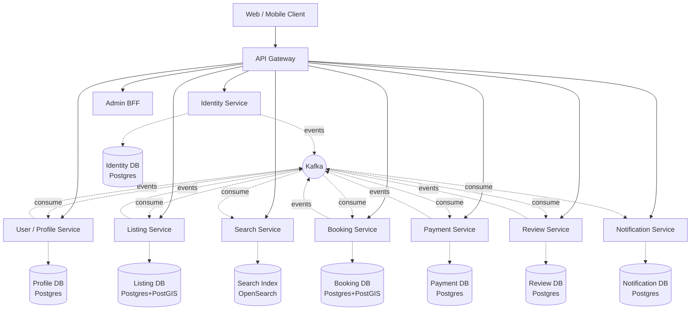
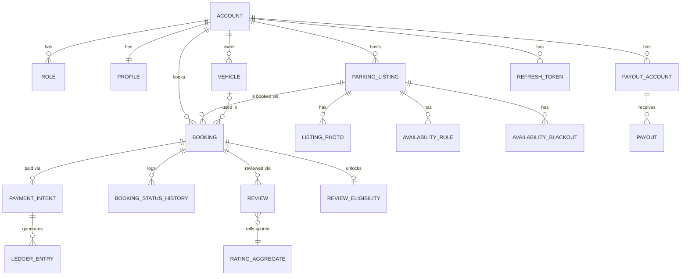

# ParkSmart — Services & Entities
### Consolidated reference: service boundaries, entity tables, ER diagrams, and an improved database schema

This consolidates and tightens the earlier Microservices Design doc, focused specifically on **services and their entities**. A few schema gaps found while consolidating are fixed in Section 5 (called out explicitly, not silently changed).

---

## 1. Service Map



**Rule that governs every box above**: one database per service, no cross-service SQL, no shared entity classes. Cross-service data needs are met by a REST call (when the caller needs a same-request answer) or a consumed event (when eventual consistency is fine). See Section 6.

---

## 2. Service Responsibility Table

| # | Service | Owns | Does Not Own |
|---|---|---|---|
| 1 | **API Gateway** | Routing, JWT validation, rate limiting | Any business data |
| 2 | **Identity Service** | Credentials, sessions/tokens, roles | Names, photos, preferences (→ Profile Service) |
| 3 | **User/Profile Service** | Display profile, vehicles, payout account tokens | Credentials, ratings (ratings are computed in Review Service, only cached here) |
| 4 | **Listing Service** | Listings, photos, availability rules/blackouts | Bookings, pricing history, search ranking |
| 5 | **Search Service** | Read-only denormalized search index | Nothing transactional — pure projection |
| 6 | **Booking Service** | Booking lifecycle, availability locking | Payment processing, listing content |
| 7 | **Payment Service** | Payment intents, ledger, payouts | Booking state (only reacts to it) |
| 8 | **Review Service** | Reviews, rating aggregates | Booking eligibility source of truth (caches a projection of it) |
| 9 | **Notification Service** | Delivery logs, channel preferences | Any domain logic — purely reactive |
| 10 | **Admin BFF** | Composed admin views only | No entities of its own |

---

## 3. Entities Per Service

### 3.1 Identity Service

| Entity | Key Fields | Notes |
|---|---|---|
| `Account` | id (UUID, PK), email, emailNormalized, phone, passwordHash, status, createdAt, updatedAt, deletedAt, version | Root of trust; status ∈ `PENDING_VERIFICATION, ACTIVE, SUSPENDED, DELETED` |
| `Role` | accountId (FK), roleType, grantedAt | Composite PK `(accountId, roleType)`; roleType ∈ `DRIVER, HOST, ADMIN` — many-to-many, a user can hold both DRIVER and HOST |
| `RefreshToken` | id, accountId (FK), tokenHash, issuedAt, expiresAt, revoked, replacedByTokenId | **Added in this pass** — needed for refresh-token rotation; original design mentioned JWT refresh but never modeled the table |
| `VerificationToken` | id, accountId (FK), purpose, tokenHash, expiresAt, consumedAt | purpose ∈ `EMAIL_VERIFY, PHONE_VERIFY, PASSWORD_RESET` |

**Key DTOs**: `RegisterRequest`, `LoginRequest`, `TokenResponse{accessToken, refreshToken, expiresIn}`, `AccountSummaryDto{id, email, roles}` — this last one, never the raw entity, is what other services ever see of an Account.

---

### 3.2 User / Profile Service

| Entity | Key Fields | Notes |
|---|---|---|
| `Profile` | accountId (PK/FK, logical), displayName, photoUrl, bio, city, updatedAt | 1:1 with Account (across service boundary, reconciled via `AccountRegistered` event) |
| `Vehicle` | id, ownerAccountId, licensePlate, plateRegion, vehicleType, make, model, color, isPrimary, createdAt, deletedAt | **Improved**: added `plateRegion` — plates are only unique within a jurisdiction, a bare unique constraint on plate alone is wrong for a multi-city/country product |
| `PayoutAccount` | id, hostAccountId, processorToken, processorType, verified, createdAt | Never stores raw bank/card data — tokenized via payment processor |
| `NotificationPreference` | accountId, channel, enabled | **Added in this pass** — was described in prose in the earlier doc but never modeled as an entity; lives here rather than in Notification Service since it's user-owned preference data, not a delivery log |

**Key DTOs**: `ProfileResponse`, `UpdateProfileRequest`, `VehicleDto`, `PublicProfileDto{displayName, photoUrl, ratingAvg}` — the *only* shape exposed to other users (never raw contact info).

---

### 3.3 Listing Service

| Entity | Key Fields | Notes |
|---|---|---|
| `ParkingListing` | id, hostAccountId, title, description, address, location (geography POINT), pricePerHour, currency, maxVehicleType, status, createdAt, updatedAt, deletedAt, version | status ∈ `DRAFT, PENDING_REVIEW, PUBLISHED, PAUSED, ARCHIVED, REJECTED` — **improved**: added `REJECTED` (moderation can fail, the earlier state list had no failure state) |
| `ListingPhoto` | id, listingId (FK), url, sortOrder | At least 1 required before `PENDING_REVIEW` |
| `AvailabilityRule` | id, listingId (FK), dayOfWeek, startTime, endTime | Recurring weekly template |
| `AvailabilityBlackout` | id, listingId (FK), dateRangeStart, dateRangeEnd, reason | One-off exceptions |
| `ListingModerationLog` | id, listingId, reviewedBy (admin accountId), decision, reason, reviewedAt | **Added in this pass** — `REJECTED` status needs an audit trail of who rejected it and why, otherwise it's an unexplained dead end for the host |

**Key DTOs**: `CreateListingRequest`, `UpdateListingRequest`, `ListingResponse`, `ListingSummaryDto{id, title, thumbnailUrl, pricePerHour}` (lightweight — used by Booking/Search, never the full entity).

---

### 3.4 Search Service

| "Entity" (projection, not transactional) | Key Fields |
|---|---|
| `ListingSearchDocument` | listingId, title, location, pricePerHour, ratingAvg, amenities, availabilityWindowsCache, lastUpdatedFromEventAt |

This is intentionally not a relational entity — it's a denormalized read model living in OpenSearch/Elasticsearch, rebuilt entirely from consumed events. **Improved**: added `lastUpdatedFromEventAt` — without a staleness timestamp on the projection, there's no way to detect or alert on a consumer falling behind, which is the single most common silent failure mode in event-driven search indexes.

**Key DTOs**: `SearchRequest{lat, lng, radiusKm, startTime, endTime, filters}`, `SearchResultDto{listingId, distanceKm, pricePerHour, ratingAvg, availableForWindow}`.

---

### 3.5 Booking Service

| Entity | Key Fields | Notes |
|---|---|---|
| `Booking` | id, driverAccountId, listingId, vehicleId, timeRange (tstzrange), status, pricePerHourSnapshot, totalAmount, currency, idempotencyKey, cancellationPolicySnapshot, createdAt, updatedAt, version | **Improved**: added `pricePerHourSnapshot` — the earlier design snapshotted the cancellation policy but not the price itself; if a host changes `pricePerHour` on the listing after a booking is created, the booking's own historical price must be preserved independent of the listing's current value |
| `BookingStatusHistory` | id, bookingId (FK), fromStatus, toStatus, changedBy, reason, changedAt | Append-only audit trail |

**Booking status values**: `PENDING_PAYMENT → CONFIRMED → CHECKED_IN → COMPLETED`, with `CANCELLED_BY_DRIVER`, `CANCELLED_BY_HOST`, `NO_SHOW`, `EXPIRED` as terminal side-branches.

**Key DTOs**: `CreateBookingRequest{listingId, vehicleId, startTime, endTime}` (with `Idempotency-Key` header), `BookingResponse`, `CancelBookingRequest{reason}`.

---

### 3.6 Payment Service

| Entity | Key Fields | Notes |
|---|---|---|
| `PaymentIntent` | id, bookingId, amount, currency, status, processorRef, createdAt | status ∈ `CREATED, AUTHORIZED, CAPTURED, FAILED, REFUNDED, PARTIALLY_REFUNDED` |
| `Payout` | id, hostAccountId, amount, periodStart, periodEnd, status, processorPayoutRef, createdAt | Batched, e.g. weekly |
| `LedgerEntry` | id, accountId, entryType (DEBIT/CREDIT), amount, referenceType, referenceId, createdAt | Immutable, double-entry style — the audit backbone for all money movement |
| `CommissionRule` | id, ratePercent, effectiveFrom, effectiveTo | **Added in this pass** — commission rate was mentioned in prose ("15%") but never modeled; without a versioned rule table, you can't answer "what commission applied to a booking from 6 months ago" once the rate changes |

**Key DTOs**: `CreatePaymentIntentRequest`, `PaymentIntentResponse`, `RefundRequest`, `PayoutSummaryDto`.

---

### 3.7 Review Service

| Entity | Key Fields | Notes |
|---|---|---|
| `Review` | id, bookingId, direction, authorAccountId, targetType, targetId, rating, comment, moderationStatus, createdAt | Unique on `(bookingId, direction)` — one review per direction per booking |
| `RatingAggregate` | targetType, targetId, avgRating, count, updatedAt | Materialized, updated async on `ReviewSubmitted` |
| `ReviewEligibility` | bookingId, driverAccountId, hostAccountId, expiresAt | **Added in this pass** — this is the "local lightweight record of which bookings are reviewable" mentioned in prose in the earlier doc; it needed to actually be named as an entity since it's what a `POST /reviews` validates against without calling Booking Service synchronously |

**Key DTOs**: `CreateReviewRequest{bookingId, rating, comment}`, `ReviewResponse`, `RatingSummaryDto{avgRating, count}`.

---

### 3.8 Notification Service

| Entity | Key Fields | Notes |
|---|---|---|
| `NotificationLog` | id, accountId, channel, templateId, status, providerRef, createdAt | status ∈ `QUEUED, SENT, FAILED, BOUNCED` |
| `NotificationTemplate` | id, channel, key, version, body | Versioned so a template change doesn't alter the historical record of what was actually sent |

Note: `NotificationPreference` moved to User/Profile Service (see 3.2) — it's user-owned settings data, not a delivery record, and belongs with the rest of the user's settings rather than duplicated here.

**Key DTOs**: `NotificationDto{id, type, message, read, createdAt}` (in-app feed only).

---

### 3.9 Admin BFF

No entities. Composed DTOs only: `ModerationQueueItemDto`, `DisputeDetailDto`, `AccountActionDto` — all built by calling other services' admin-scoped endpoints at request time.

---

## 4. Entity Relationship Diagram (Cross-Service)



*All cross-service links (e.g., `ACCOUNT ||--o{ PARKING_LISTING`) are logical references by ID, not physical foreign keys — each entity lives in its own service's database.*

---

## 5. Improved Database Schema

Changes from the original draft are called out inline with **[IMPROVED]** or **[NEW]** tags.

```sql
-- ============================================================
-- IDENTITY SERVICE
-- ============================================================
CREATE TABLE accounts (
  id UUID PRIMARY KEY DEFAULT gen_random_uuid(),
  email VARCHAR(255) NOT NULL,
  email_normalized VARCHAR(255) GENERATED ALWAYS AS (LOWER(email)) STORED,
  phone VARCHAR(20),
  password_hash VARCHAR(255) NOT NULL,
  status VARCHAR(30) NOT NULL DEFAULT 'PENDING_VERIFICATION',
  created_at TIMESTAMPTZ NOT NULL DEFAULT now(),
  updated_at TIMESTAMPTZ NOT NULL DEFAULT now(),
  deleted_at TIMESTAMPTZ,
  version INT NOT NULL DEFAULT 0,
  CONSTRAINT uq_accounts_email UNIQUE (email_normalized)
);
CREATE UNIQUE INDEX uq_accounts_phone ON accounts (phone) WHERE phone IS NOT NULL AND deleted_at IS NULL;

CREATE TABLE roles (
  account_id UUID NOT NULL REFERENCES accounts(id),
  role_type VARCHAR(20) NOT NULL,
  granted_at TIMESTAMPTZ NOT NULL DEFAULT now(),
  PRIMARY KEY (account_id, role_type)
);

-- [NEW] Refresh token table — required for JWT rotation, was referenced in prose but never modeled
CREATE TABLE refresh_tokens (
  id UUID PRIMARY KEY DEFAULT gen_random_uuid(),
  account_id UUID NOT NULL REFERENCES accounts(id),
  token_hash VARCHAR(255) NOT NULL,
  issued_at TIMESTAMPTZ NOT NULL DEFAULT now(),
  expires_at TIMESTAMPTZ NOT NULL,
  revoked BOOLEAN NOT NULL DEFAULT false,
  replaced_by_token_id UUID REFERENCES refresh_tokens(id)
);
CREATE INDEX idx_refresh_tokens_account ON refresh_tokens (account_id) WHERE revoked = false;

CREATE TABLE verification_tokens (
  id UUID PRIMARY KEY DEFAULT gen_random_uuid(),
  account_id UUID NOT NULL REFERENCES accounts(id),
  purpose VARCHAR(20) NOT NULL, -- EMAIL_VERIFY, PHONE_VERIFY, PASSWORD_RESET
  token_hash VARCHAR(255) NOT NULL,
  expires_at TIMESTAMPTZ NOT NULL,
  consumed_at TIMESTAMPTZ
);

-- ============================================================
-- USER / PROFILE SERVICE
-- ============================================================
CREATE TABLE profiles (
  account_id UUID PRIMARY KEY, -- logical FK to accounts.id in Identity DB
  display_name VARCHAR(150),
  photo_url VARCHAR(1024),
  bio TEXT,
  city VARCHAR(150),
  updated_at TIMESTAMPTZ NOT NULL DEFAULT now()
);

CREATE TABLE vehicles (
  id UUID PRIMARY KEY DEFAULT gen_random_uuid(),
  owner_account_id UUID NOT NULL,
  license_plate VARCHAR(20) NOT NULL,
  plate_region VARCHAR(10) NOT NULL, -- [IMPROVED] e.g. 'IN-MH' — plates are only unique within a jurisdiction
  vehicle_type VARCHAR(20) NOT NULL,
  make VARCHAR(60), model VARCHAR(60), color VARCHAR(30),
  is_primary BOOLEAN NOT NULL DEFAULT false,
  created_at TIMESTAMPTZ NOT NULL DEFAULT now(),
  deleted_at TIMESTAMPTZ
);
CREATE UNIQUE INDEX uq_one_primary_vehicle ON vehicles (owner_account_id) WHERE is_primary AND deleted_at IS NULL;
CREATE UNIQUE INDEX uq_plate_per_region ON vehicles (license_plate, plate_region) WHERE deleted_at IS NULL; -- [IMPROVED]

CREATE TABLE payout_accounts (
  id UUID PRIMARY KEY DEFAULT gen_random_uuid(),
  host_account_id UUID NOT NULL,
  processor_token VARCHAR(255) NOT NULL,
  processor_type VARCHAR(30) NOT NULL, -- STRIPE_CONNECT, RAZORPAY_ROUTE
  verified BOOLEAN NOT NULL DEFAULT false,
  created_at TIMESTAMPTZ NOT NULL DEFAULT now()
);

-- [NEW] Was described in prose only; now modeled explicitly
CREATE TABLE notification_preferences (
  account_id UUID NOT NULL,
  channel VARCHAR(20) NOT NULL, -- EMAIL, SMS, PUSH, IN_APP
  enabled BOOLEAN NOT NULL DEFAULT true,
  PRIMARY KEY (account_id, channel)
);

-- ============================================================
-- LISTING SERVICE
-- ============================================================
CREATE TABLE parking_listings (
  id UUID PRIMARY KEY DEFAULT gen_random_uuid(),
  host_account_id UUID NOT NULL,
  title VARCHAR(255) NOT NULL,
  description TEXT,
  address VARCHAR(512) NOT NULL,
  location GEOGRAPHY(POINT, 4326) NOT NULL,
  price_per_hour NUMERIC(8,2) NOT NULL CHECK (price_per_hour > 0),
  currency CHAR(3) NOT NULL DEFAULT 'INR',
  max_vehicle_type VARCHAR(20),
  status VARCHAR(20) NOT NULL DEFAULT 'DRAFT', -- [IMPROVED] now includes REJECTED
  created_at TIMESTAMPTZ NOT NULL DEFAULT now(),
  updated_at TIMESTAMPTZ NOT NULL DEFAULT now(),
  deleted_at TIMESTAMPTZ,
  version INT NOT NULL DEFAULT 0,
  CONSTRAINT chk_listing_status CHECK (status IN
    ('DRAFT','PENDING_REVIEW','PUBLISHED','PAUSED','ARCHIVED','REJECTED'))
);
CREATE INDEX idx_listings_geo ON parking_listings USING GIST (location);
CREATE INDEX idx_listings_host ON parking_listings (host_account_id) WHERE deleted_at IS NULL;
CREATE INDEX idx_listings_status ON parking_listings (status) WHERE deleted_at IS NULL;

CREATE TABLE listing_photos (
  id UUID PRIMARY KEY DEFAULT gen_random_uuid(),
  listing_id UUID NOT NULL REFERENCES parking_listings(id) ON DELETE CASCADE,
  url VARCHAR(1024) NOT NULL,
  sort_order INT NOT NULL DEFAULT 0
);

CREATE TABLE availability_rules (
  id UUID PRIMARY KEY DEFAULT gen_random_uuid(),
  listing_id UUID NOT NULL REFERENCES parking_listings(id) ON DELETE CASCADE,
  day_of_week SMALLINT NOT NULL,
  start_time TIME NOT NULL,
  end_time TIME NOT NULL,
  CHECK (start_time < end_time)
);

CREATE TABLE availability_blackouts (
  id UUID PRIMARY KEY DEFAULT gen_random_uuid(),
  listing_id UUID NOT NULL REFERENCES parking_listings(id) ON DELETE CASCADE,
  date_range TSTZRANGE NOT NULL,
  reason VARCHAR(255)
);

-- [NEW] Audit trail for moderation decisions — required once REJECTED is a real status
CREATE TABLE listing_moderation_log (
  id UUID PRIMARY KEY DEFAULT gen_random_uuid(),
  listing_id UUID NOT NULL REFERENCES parking_listings(id),
  reviewed_by UUID NOT NULL, -- admin account id
  decision VARCHAR(20) NOT NULL, -- APPROVED, REJECTED
  reason VARCHAR(500),
  reviewed_at TIMESTAMPTZ NOT NULL DEFAULT now()
);

-- ============================================================
-- BOOKING SERVICE
-- ============================================================
CREATE TABLE bookings (
  id UUID PRIMARY KEY DEFAULT gen_random_uuid(),
  driver_account_id UUID NOT NULL,
  listing_id UUID NOT NULL,
  vehicle_id UUID,
  time_range TSTZRANGE NOT NULL,
  status VARCHAR(30) NOT NULL DEFAULT 'PENDING_PAYMENT',
  price_per_hour_snapshot NUMERIC(8,2) NOT NULL, -- [IMPROVED] preserves historical price independent of listing's current price
  total_amount NUMERIC(10,2) NOT NULL,
  currency CHAR(3) NOT NULL DEFAULT 'INR',
  cancellation_policy_snapshot JSONB,
  idempotency_key VARCHAR(100) NOT NULL,
  created_at TIMESTAMPTZ NOT NULL DEFAULT now(),
  updated_at TIMESTAMPTZ NOT NULL DEFAULT now(),
  version INT NOT NULL DEFAULT 0,
  CONSTRAINT uq_booking_idempotency UNIQUE (idempotency_key),
  CONSTRAINT excl_booking_overlap EXCLUDE USING gist (
    listing_id WITH =,
    time_range WITH &&
  ) WHERE (status IN ('PENDING_PAYMENT','CONFIRMED','CHECKED_IN'))
);
CREATE INDEX idx_bookings_driver ON bookings (driver_account_id);
CREATE INDEX idx_bookings_listing_time ON bookings USING GIST (listing_id, time_range);

CREATE TABLE booking_status_history (
  id UUID PRIMARY KEY DEFAULT gen_random_uuid(),
  booking_id UUID NOT NULL REFERENCES bookings(id),
  from_status VARCHAR(30), to_status VARCHAR(30) NOT NULL,
  changed_by UUID, reason VARCHAR(255),
  changed_at TIMESTAMPTZ NOT NULL DEFAULT now()
);

-- ============================================================
-- PAYMENT SERVICE
-- ============================================================
CREATE TABLE payment_intents (
  id UUID PRIMARY KEY DEFAULT gen_random_uuid(),
  booking_id UUID NOT NULL,
  amount NUMERIC(10,2) NOT NULL,
  currency CHAR(3) NOT NULL,
  status VARCHAR(20) NOT NULL,
  processor_ref VARCHAR(255),
  created_at TIMESTAMPTZ NOT NULL DEFAULT now()
);
CREATE INDEX idx_payment_intents_booking ON payment_intents (booking_id); -- [IMPROVED] was missing

CREATE TABLE payouts (
  id UUID PRIMARY KEY DEFAULT gen_random_uuid(),
  host_account_id UUID NOT NULL,
  amount NUMERIC(10,2) NOT NULL,
  period_start DATE, period_end DATE,
  status VARCHAR(20) NOT NULL,
  processor_payout_ref VARCHAR(255),
  created_at TIMESTAMPTZ NOT NULL DEFAULT now()
);
CREATE INDEX idx_payouts_host ON payouts (host_account_id); -- [IMPROVED] was missing

CREATE TABLE ledger_entries (
  id UUID PRIMARY KEY DEFAULT gen_random_uuid(),
  account_id UUID NOT NULL,
  entry_type VARCHAR(10) NOT NULL,
  amount NUMERIC(10,2) NOT NULL,
  reference_type VARCHAR(30) NOT NULL,
  reference_id UUID NOT NULL,
  created_at TIMESTAMPTZ NOT NULL DEFAULT now()
);
CREATE INDEX idx_ledger_account_time ON ledger_entries (account_id, created_at); -- [IMPROVED] was missing, needed for statements

-- [NEW] Versioned commission rate — "15%" was only ever mentioned in prose
CREATE TABLE commission_rules (
  id UUID PRIMARY KEY DEFAULT gen_random_uuid(),
  rate_percent NUMERIC(5,2) NOT NULL,
  effective_from TIMESTAMPTZ NOT NULL,
  effective_to TIMESTAMPTZ
);

-- ============================================================
-- REVIEW SERVICE
-- ============================================================
CREATE TABLE reviews (
  id UUID PRIMARY KEY DEFAULT gen_random_uuid(),
  booking_id UUID NOT NULL,
  direction VARCHAR(20) NOT NULL,
  author_account_id UUID NOT NULL,
  target_type VARCHAR(20) NOT NULL,
  target_id UUID NOT NULL,
  rating SMALLINT NOT NULL CHECK (rating BETWEEN 1 AND 5),
  comment TEXT,
  moderation_status VARCHAR(20) NOT NULL DEFAULT 'PUBLISHED',
  created_at TIMESTAMPTZ NOT NULL DEFAULT now(),
  CONSTRAINT uq_review_per_direction UNIQUE (booking_id, direction)
);

-- [NEW] Local projection of booking-completion eligibility, avoids sync calls to Booking Service per review
CREATE TABLE review_eligibility (
  booking_id UUID PRIMARY KEY,
  driver_account_id UUID NOT NULL,
  host_account_id UUID NOT NULL,
  expires_at TIMESTAMPTZ NOT NULL
);

CREATE TABLE rating_aggregates (
  target_type VARCHAR(20) NOT NULL,
  target_id UUID NOT NULL,
  avg_rating NUMERIC(3,2) NOT NULL DEFAULT 0,
  review_count INT NOT NULL DEFAULT 0,
  updated_at TIMESTAMPTZ NOT NULL DEFAULT now(),
  PRIMARY KEY (target_type, target_id)
);

-- ============================================================
-- NOTIFICATION SERVICE
-- ============================================================
CREATE TABLE notification_templates (
  id UUID PRIMARY KEY DEFAULT gen_random_uuid(),
  channel VARCHAR(20) NOT NULL,
  template_key VARCHAR(100) NOT NULL,
  version INT NOT NULL DEFAULT 1,
  body TEXT NOT NULL,
  CONSTRAINT uq_template_key_version UNIQUE (template_key, version)
);

CREATE TABLE notification_log (
  id UUID PRIMARY KEY DEFAULT gen_random_uuid(),
  account_id UUID NOT NULL,
  channel VARCHAR(20) NOT NULL,
  template_id UUID REFERENCES notification_templates(id),
  status VARCHAR(20) NOT NULL,
  provider_ref VARCHAR(255),
  created_at TIMESTAMPTZ NOT NULL DEFAULT now()
);
CREATE INDEX idx_notification_log_account ON notification_log (account_id, created_at);
```

---

## 6. Summary of Schema Improvements Made in This Pass

| Change | Reason |
|---|---|
| **[NEW]** `refresh_tokens` table | Referenced in design prose ("JWT + refresh token rotation") but never actually modeled — can't build the auth flow without it |
| **[NEW]** `notification_preferences` table | Same issue — mentioned as a concept, never given columns |
| **[IMPROVED]** `vehicles.plate_region` + composite unique index | A bare unique constraint on `license_plate` alone is wrong — plates repeat across states/countries |
| **[IMPROVED]** `parking_listings.status` includes `REJECTED` | The original state list had no failure path for moderation |
| **[NEW]** `listing_moderation_log` | `REJECTED` needs an audit trail — otherwise a host has no way to know why, and there's no accountability for the decision |
| **[IMPROVED]** `bookings.price_per_hour_snapshot` | The cancellation policy was snapshotted but not the price — a listing's price changing after booking must not retroactively alter a past booking's numbers |
| **[NEW]** `commission_rules` table | The 15% commission rate existed only as a number in prose; without versioning it, historical bookings can't be audited correctly after a rate change |
| **[NEW]** `review_eligibility` table | Named and given columns for what was previously just described as "a local lightweight record" |
| **[IMPROVED]** Added missing indexes | `payment_intents.booking_id`, `payouts.host_account_id`, `ledger_entries(account_id, created_at)` were referenced by query patterns (e.g., "get all payments for a booking," "generate a host statement") but had no supporting index in the original draft |
| **[IMPROVED]** `ListingSearchDocument.lastUpdatedFromEventAt` | Without a staleness marker, a lagging or dead Kafka consumer in Search Service fails silently |

None of these are large redesigns — they're the kind of gaps that don't show up until you're actually writing the migration or the query and realize the column or table isn't there. Better to hit them now than mid-sprint.